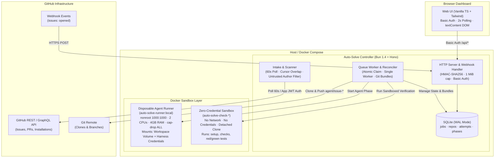
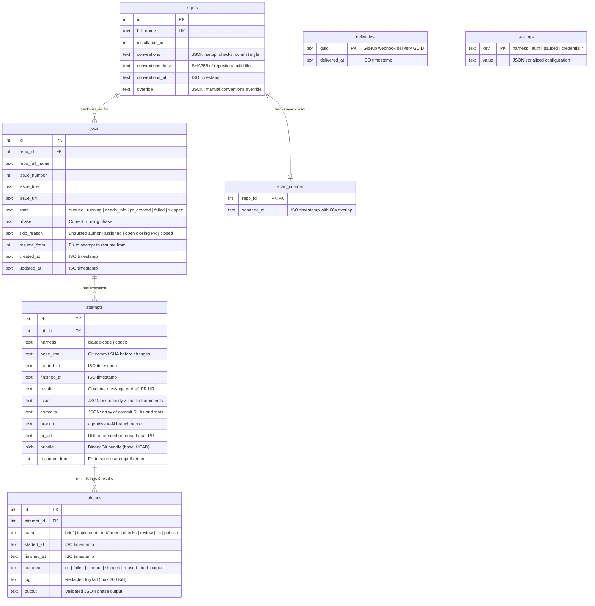
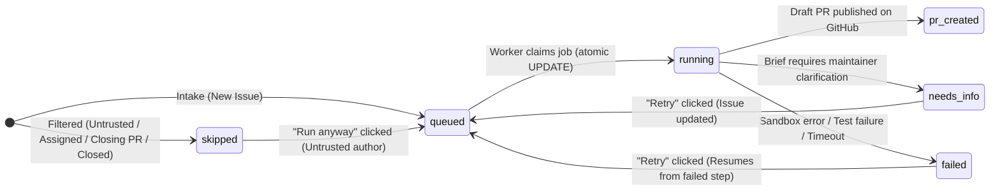
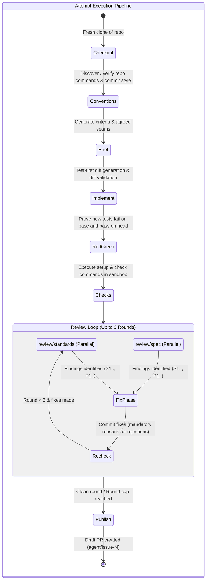
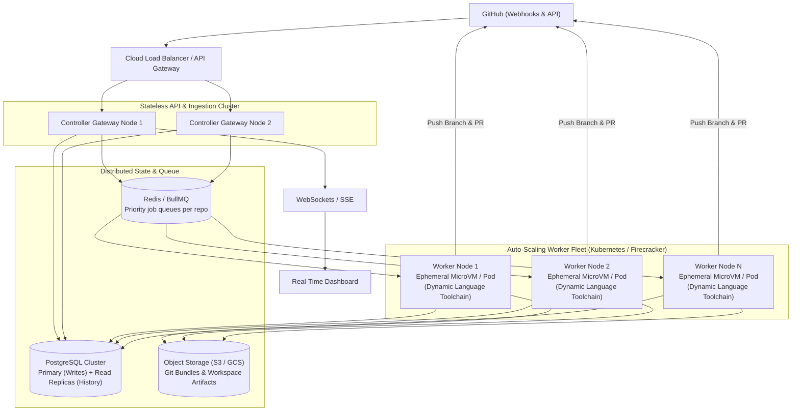

# issue-solver

Turn GitHub issues into clean, test-first pull requests with automated code reviews.

**Local dashboard:** [http://localhost:3000](http://localhost:3000) (admin protected)  
**Supported harnesses:** Claude Code (personal OAuth token) · OpenAI Codex (ChatGPT device login)  
**Sandboxing:** Docker Engine with dropped Linux capabilities and nonroot runner isolation  
**Cost profile:** Flat subscription only — zero metered token bills, zero API keys required  

> [!NOTE]
> `issue-solver` uses your personal Claude (Pro/Team) or ChatGPT (Plus/Pro) subscription via official CLI harnesses. It never asks for, stores, or consumes metered API keys.

---

## The Problem

Maya maintains several open-source libraries on GitHub. On Monday morning, 14 new notifications await her:
- Four duplicate questions that belong in GitHub Discussions.
- Three feature requests lacking clear acceptance criteria.
- Two stale bug reports from non-collaborators with no reproductions.
- One subtle off-by-one regression in the parser with a reproducible stack trace.

Triage, setting up clean workspaces, reproducing regressions, writing isolated test cases, conforming to each repository's custom linter and commit conventions, and performing thorough code reviews eats hours of maintainer time.

Meanwhile, handing issues over to naive AI coding bots usually makes things worse:
- **Tautological tests**: The bot writes tests that pass on the broken code before any fix is applied, proving nothing.
- **Spec drift & regressions**: The bot fixes the immediate symptom by changing public function signatures, breaking downstream callers.
- **CI tampering**: When tests fail, the bot edits `.github/workflows/` or disables linter rules to force a green checkmark.
- **Spam PRs**: The bot opens half-baked, untested PRs directly to default branches without maintainer review.

`issue-solver` solves this by bringing strict software engineering discipline to AI-driven issue resolution. Whether run interactively in your terminal (`solve-issue`) or as an unattended self-hosted service (`auto-solve`), every change is bound to agreed test seams, validated through mathematical **red/green proof** (tests must fail on base and pass on head), audited across **Standards** and **Spec** axes, and published as a clean draft pull request.

---

## Features

### 1. Manual `solve-issue` Skill Bundle (Interactive)
- **Harness-neutral agent workflow**: Installs into Claude Code, OpenAI Codex, Cursor, or any Agent Skills harness.
- **Intelligent candidate shortlisting**: Discovers open issues, filters out assigned work and active PRs, and highlights high-signal candidates based on maintainer activity and scope.
- **Human-in-the-loop gates**: You select the issue, approve the generated brief, agree on public test seams, and explicitly confirm before any branch is pushed.
- **Automated workspace management**: Detects whether you have write permissions; clones direct or sets up an authenticated fork with upstream tracking.
- **Test-first implementation**: Enforces test-driven development via the `tdd` skill, ensuring regression tests are committed before code edits.

### 2. Automated `auto-solve` Service (Unattended)
- **Zero-touch background controller**: Continuously monitors your personal repositories via 60-second polling or immediate HMAC-verified GitHub webhooks.
- **Dynamic conventions discovery**: Explores each repository's toolchain to discover setup commands, check commands, single-test execution syntax, commit styles, and test presence.
- **Strict sandbox isolation**: Agents run inside disposable, nonroot Docker containers with dropped capabilities (`--cap-drop ALL`), memory limits (4 GiB), and CPU limits (2 CPUs).
- **Zero-credential check execution**: Repository build, setup, and check commands run in a sanitized container with no network access and no authentication tokens.
- **Mathematical Red/Green Proof**: Overlays new test files onto the base commit and verifies failure; then verifies passing execution on head. Catches and rejects tautological tests.
- **Dual-Axis Code Review Loop**: Conducts parallel code reviews on two distinct axes:
  - **Standards**: Repository coding style, code smells, resource leaks, and hygiene.
  - **Spec**: Acceptance criteria fidelity, regression prevention, and edge cases.
- **Automated fix & re-check rounds**: Up to 3 review/fix rounds. The agent must justify every rejected finding and make real changes for fixed findings, followed by complete sandbox re-checks.
- **Safe draft publishing**: Pushes to `agent/issue-<number>` and opens a draft PR with full test receipts, criteria checklists, and review decisions. Never force-pushes, writes to default branches, or auto-merges.
- **Resilient crash recovery**: Serializes Git commits into portable Git bundles after every phase. If an attempt is interrupted or fails, Retry resumes from the exact stopped step without repeating completed work.

### 3. Web Dashboard
- **Live job inspector**: Filter jobs by state (`queued`, `running`, `needs_info`, `pr_created`, `failed`, `skipped`).
- **Real-time execution timeline**: Inspect every phase, view truncated and redacted stdout/stderr logs (up to 200 KiB), inspect Git diff stats, and review acceptance criteria checklists.
- **Repository overrides**: View discovered conventions per repo and apply custom overrides (setup, checks, test templates, commit styles).
- **Harness switcher & liveness testing**: Toggle between Claude Code and OpenAI Codex, inspect credential age, and execute interactive auth/quota checks.
- **Security controls**: Review issues skipped due to untrusted authors and trigger execution with one click (**Run anyway**).
- **Guaranteed safe rendering**: Strict DOM `textContent` rendering audited by automated security scripts to prevent stored XSS from untrusted issue bodies.

---

## Architecture



### Security and Sandbox Model

The service separates privileges across three isolated trust boundaries:

1. **Host Controller**:
   - Holds the GitHub App private key, webhook secret, and host Docker socket.
   - Runs the HTTP API, intake scanners, database operations, and Git publishing operations.
   - **Never executes arbitrary repository code directly on the host.**
2. **Runner Container (`auto-solve-runner:local`)**:
   - Disposable container started per agent phase (`conventions`, `brief`, `implement`, `review`, `fix`).
   - Runs as nonroot user (`1000:1000`) with strict resource constraints: 2 CPUs, 4 GiB RAM, 256 PIDs, dropped Linux capabilities (`--cap-drop ALL`), and `--security-opt no-new-privileges`.
   - Mounts only the current workspace subpath from the shared volume and the active harness credential.
   - **Never receives the Docker socket, GitHub App private keys, or host filesystem paths.**
3. **Checks Sandbox Container**:
   - Fresh container created specifically to run repository commands (`setup_command`, `check_commands`, `test_file_command`).
   - Runs on a detached Git clone of the workspace.
   - **Has no network access, zero credentials, and no harness access.**
   - Protects against malicious repositories or poisoned dependencies attempting network exfiltration during build/test steps.

---

## Data Model



### Storage Characteristics
- **SQLite with WAL Mode**: Concurrent readers never block writes; uses `PRAGMA synchronous = FULL` for durability.
- **Git Bundles (`attempts.bundle`)**: Binary Git bundle created via `git bundle create base..HEAD` after every commit. Preserves exact commit SHAs and tree objects, allowing a resumed attempt to restore full Git history into a fresh clone even if the workspace volume was wiped.
- **Zero Unsanitized HTML**: All text stored in the database is rendered into the dashboard via DOM `textContent`.

---

## State Machines

### 1. Job Lifecycle



### 2. Attempt Phase Execution Pipeline



### Pipeline Rules & Guards
- `needs_info` exits immediately: If an issue is ambiguous or lacks verifiable acceptance criteria, the pipeline halts and sets state to `needs_info` (optionally posting questions as an issue comment).
- `tautological tests` rejected: If overlaid tests pass on the base commit, the attempt fails with `tautological test: '<cmd>' passes on base`.
- Tamper detection: `.git/config` is hashed before and after agent phases. Any unauthorized modification to Git hooks or filters immediately aborts the attempt.
- Terminal States: `pr_created` is terminal. `failed` and `needs_info` can be retried via `POST /api/jobs/:id/retry`.

---

## Tech Stack

| Choice | Realistic Alternatives | Why It Fits `issue-solver` | What Would Make Us Switch |
|---|---|---|---|
| **Bun 1.4 + TypeScript** | Node.js, Go, Python/FastAPI | Native TypeScript execution without transpilation steps, ultra-fast built-in SQLite engine (`bun:sqlite`), fast subprocess spawning, and built-in test runner. | Need for compiled single-binary distribution (Go/Rust) or Python-only machine learning dependencies. |
| **Hono** | Express 5, Fastify, NestJS | Lightweight, zero-dependency HTTP framework with built-in basic auth and middleware; cleanly defines API routes without decorator bloat. | Enterprise requirements for complex microservice plugins or GraphQL schemas. |
| **SQLite (WAL Mode)** | PostgreSQL, MySQL | Embedded, zero-configuration single-file database. WAL mode enables concurrent reads during writes; perfect for self-hosted single-tenant services. | Horizontal scale-out across multiple controller nodes requiring distributed database clustering. |
| **Docker CLI + Isolation** | Podman, Firecracker, gVisor | Universal container standard; lets the nonroot controller spawn disposable runner containers with dropped Linux capabilities and memory/CPU quotas. | Bare-metal environments without Docker access, or high-density multi-tenant cloud runners requiring sub-millisecond microVM boot times. |
| **Claude Code & Codex CLIs** | Direct OpenAI/Anthropic API keys, LangChain | Operates strictly via flat personal subscription credentials (Claude Pro/Team OAuth or ChatGPT Plus/Pro device login), avoiding unpredictable metered token bills. | Enterprise teams mandating centralized corporate API billing and programmatic rate-limit quotas over personal subscriptions. |
| **GitHub App (JWT + Private Key)** | Personal Access Tokens (PAT), OAuth App | Scoped per-repository permissions, short-lived 1-hour installation tokens, native webhook delivery, and zero reliance on personal access tokens. | Self-hosted GitLab, Bitbucket, or Gitea installations where GitHub Apps are unavailable. |
| **Vanilla TS DOM UI + Tailwind** | React, Next.js, Vue, Svelte | Strict `textContent`-only rendering guarantees 100% immunity to raw HTML injection (XSS); ultra-fast single-page bundle without virtual DOM or hydration overhead. | Complex dashboard requirements demanding interactive drag-and-drop workflow builders or advanced charting libraries. |

---

## Project Structure

```
.
├── docker-compose.yml             controller + runner Docker compose configuration
├── .env.example                   documented environment variables template
├── LICENSE                        MIT license
├── README.md                      this guide
├── scripts/
│   ├── check-skills.sh            validates skill metadata and harness-neutral wording
│   ├── test-candidates.sh         verifies issue candidate filtering logic
│   ├── test-workspace.sh          tests workspace setup, branching, and fork resolution
│   └── fixtures/issues.json       test fixture for issue candidates
├── skills/                        single source of truth for prompts and engineering standards
│   ├── solve-issue/               user-invoked coordinator skill (shortlist, branch, PR)
│   ├── agent-brief/               structured briefs with acceptance criteria and seams
│   ├── tdd/                       test-driven development and red/green proof rules
│   ├── implement/                 implementation guidelines for code changes
│   ├── code-review/               two-axis code review rules (Standards and Spec)
│   └── github/                    gh CLI helpers and conventions
└── service/                       unattended auto-solve background controller and dashboard
    ├── Dockerfile                 controller container definition (Bun 1.4)
    ├── runner.Dockerfile          disposable runner container definition (Claude, Codex, Bun, Git)
    ├── package.json               pinned dependencies
    ├── bun.lock                   committed lockfile
    ├── dist/                      compiled frontend assets (index.html, app.js, app.css)
    ├── scripts/
    │   ├── smoke.ts               end-to-end integration smoke test against real GitHub issues
    │   └── no-html-insertion.sh   static security audit enforcing zero raw HTML insertion
    ├── src/
    │   ├── main.ts                entrypoint: loads config, initializes harnesses, starts server
    │   ├── app.ts                 Hono API router, webhook handler, scanner, and worker loops
    │   ├── db.ts                  SQLite database schema and migrations (WAL mode)
    │   ├── config.ts              environment variable parsing and validation
    │   ├── runner.ts              Docker container manager for runners and sandboxes
    │   ├── harness.ts             abstract interface for agent harnesses
    │   ├── claude-code.ts         Claude Code CLI integration (OAuth token, stream-json)
    │   ├── codex.ts               OpenAI Codex CLI integration (ChatGPT device login, schema files)
    │   ├── conventions.ts         repository convention discovery and caching
    │   ├── brief.ts               agent brief generation and criteria extraction
    │   ├── implement.ts           test-first implementation, diff validation, and Git bundling
    │   ├── verify.ts              sandboxed red/green proof engine and checks runner
    │   ├── review.ts              dual-axis review prompts, fix loop, and schema validation
    │   ├── publish.ts             draft PR generation and GitHub publishing
    │   ├── github.ts              GitHub App client (JWT generation, Octokit calls)
    │   ├── clock.ts               time abstraction for testing
    │   └── ui/                    dashboard source code
    │       ├── app.ts             hash router, DOM rendering, and API polling
    │       ├── app.css            Tailwind entrypoint
    │       └── index.html         static container
    └── test/                      comprehensive unit and integration test suite (210+ tests)
```

---

## 1. Manual `solve-issue` Skill Bundle

The `solve-issue` skill bundle walks you interactively from "I want to fix something" to an opened pull request: pick an issue from a shortlisted backlog, draft a testable brief, implement it test-first at agreed seams, review it across Standards and Spec axes, and push after your explicit confirmation.

Requires the [`gh` CLI](https://cli.github.com) logged in (`gh auth login`), plus `git` and `bash`.

### Install

#### skills.sh (Codex, Claude Code, Cursor, and other Agent Skills harnesses)

```bash
npx skills add adib-11/issue-solver
```

Pick your harness when prompted, or pass `-a <agent>` (for example `-a codex`). All skills in `skills/` install together; `solve-issue` depends on the others.

#### Claude Code plugin

In Claude Code:

```
/plugin marketplace add adib-11/issue-solver
/plugin install solve-issue@issue-solver
```

For a local checkout, start Claude Code with `claude --plugin-dir /path/to/issue-solver`.

#### Manual

Copy every directory under `skills/` into your harness's skills directory (for example `~/.codex/skills/` or `~/.claude/skills/`).

### Run

- **Claude Code:** `/solve-issue` (or as a plugin: `/solve-issue:solve-issue`)
- **Codex:** `$solve-issue`, or select it from `/skills`
- **Other harnesses:** invoke the `solve-issue` skill following the harness's conventions for user-invoked skills

### Harness metadata

- `SKILL.md` frontmatter `disable-model-invocation: true` prevents harnesses from invoking `solve-issue` and `implement` autonomously.
- `agents/openai.yaml` sets `policy.allow_implicit_invocation: false` for the same skills in Codex.
- `bash scripts/check-skills.sh` verifies that every skill conforms to these requirements and contains no harness-specific tool names.

---

## 2. How the Service Relates to the Manual Skill Bundle

| Aspect | Manual `solve-issue` Skill Bundle | Automated `auto-solve` Service |
|---|---|---|
| **Invocation** | Interactive, user-invoked in agent terminal/chat | Unattended background service (polling or webhooks) |
| **Repository Scope** | Any repo (personal, forks, external open-source) | Personal GitHub account repos only (orgs and forks rejected) |
| **Human Gates** | Human picks issue, approves brief/seams, confirms push | Human only reviews the final draft PR on GitHub (or clicks Retry / Run anyway in dashboard) |
| **Execution Environment** | Host machine / local harness workspace | Disposable Docker runner containers (no credentials, dropped caps) |
| **Source of Truth** | [`skills/`](skills/) markdown files | Reads and inlines the exact same [`skills/`](skills/) files into agent prompts |

Both surfaces enforce the exact same engineering discipline: test-first development with red/green proof, repository-discovered conventions, and two-axis code reviews (Standards and Spec).

---

## 3. The `auto-solve` Service

`service/` contains an unattended background controller and dashboard that works through open issues on your personal GitHub repositories.

### What it does

1. **Intake**: Discovers open issues on your enabled repositories via polling (every 60s) or webhooks. Filters out assigned issues, issues already addressed by open PRs, forks, and archived repositories. Untrusted authors (issues opened by non-collaborators) are marked `skipped: untrusted author` and require clicking **Run anyway** in the dashboard.
2. **Conventions**: Runs an agent phase to discover each repo's setup command, check commands, single-test-file command template, commit style, and whether tests exist. Conventions are cached and can be overridden via the dashboard Repos page.
3. **Brief**: Turns the issue into a structured brief with independently checkable acceptance criteria and agreed test seams. If an issue is too vague, it becomes `needs_info` with open questions (optionally posted as an issue comment).
4. **Implement**: Implements the fix test-first in an isolated container. The agent only edits files; the controller validates the diff (rejecting empty diffs, workflow edits, or missing tests when tests exist) and creates commits in the repository's commit style.
5. **Red/Green Proof & Checks**: Verifies that each new test fails on the base code and passes on the change. Then runs the repository's setup and check commands in a clean container with zero credentials.
6. **Review Loop**: Reviews the change in two parallel sessions: **Standards** (repository guidelines + code smell baseline) and **Spec** (the brief + issue snapshot). A fix phase decides each finding (fixed, or rejected with a mandatory reason), commits fixes, and re-runs checks (up to 3 rounds).
7. **Publish Draft PR**: Pushes the commits to `agent/issue-<number>` and opens a single draft pull request with a complete summary, acceptance criteria checklist, seams tested, check results, and review decisions. Reuses existing PRs if present; never force-pushes, writes to default branches, or auto-merges.

### Security and Sandbox Model

- **Controller**: Holds the GitHub App private key and host Docker socket. It never executes arbitrary repository code directly on the host.
- **Runners**: Each agent phase runs in a disposable, nonroot container limited to 2 CPUs, 4 GiB RAM, 256 PIDs, with dropped capabilities and `no-new-privileges`. Runners mount only the workspace volume and the active harness credentials; they never receive GitHub tokens or the Docker socket.
- **Checks Sandbox**: Repository build, setup, and check commands run in a fresh container with no network, no credentials, and no harness access.

---

## 4. Setup and Quick Start

You can go from zero to a running service using only this guide.

### Prerequisites

- [Docker Engine 26+](https://docs.docker.com/engine/install/) with Docker Compose v2.
- A personal GitHub account.
- An active Claude (Pro/Team) or ChatGPT (Plus/Team/Pro) subscription.

### Step 1: Create a GitHub App

1. In your browser, navigate to [GitHub Developer Settings > GitHub Apps > New GitHub App](https://github.com/settings/apps/new).
2. Configure the general settings:
   - **GitHub App name**: A unique name (e.g. `auto-solve-<your-username>`).
   - **Homepage URL**: Your GitHub profile URL or repository URL.
   - **Webhook**:
     - If using default polling: leave **Active** unchecked.
     - If using webhooks: check **Active**, set **Webhook URL** to `https://<your-public-domain>/api/webhook`, and set a strong **Webhook secret** (to be used as `WEBHOOK_SECRET` in `.env`).
3. Set **Repository permissions**:
   - **Issues**: `Read-only` (or `Read and write` if you want the service to post `needs_info` questions as issue comments when `COMMENT_QUESTIONS=true`).
   - **Contents**: `Read and write` (required to clone code and push feature branches).
   - **Pull requests**: `Read and write` (required to open draft pull requests).
   - **Metadata**: `Read-only` (selected automatically by GitHub).
4. Subscribe to events (only if using webhooks):
   - Check **Issues** under event subscriptions.
5. Under **Where can this GitHub App be installed?**, select **Only on this account**.
6. Click **Create GitHub App**.
7. On the App settings page:
   - Note the numeric **App ID** (you will set this as `GITHUB_APP_ID`).
   - Under **Private keys**, click **Generate a private key**. Save the downloaded `.pem` file as `./github-app.pem` in the root of your local clone.

### Step 2: Install the GitHub App

1. From the GitHub App's settings sidebar, click **Install App**.
2. Click **Install** next to your **personal account**.
   > [!IMPORTANT]
   > The App must be installed on your personal user account. The service explicitly rejects installations on organizations.
3. Choose repository access: select **All repositories** or choose specific repositories you want `auto-solve` to process.

### Step 3: Configure `.env`

Copy `.env.example` to `.env`:

```bash
cp .env.example .env
```

Edit `.env` with your settings:

```dotenv
# Required: Your personal GitHub username
OWNER_LOGIN=octocat

# Required: GitHub App ID from the App settings page
GITHUB_APP_ID=123456

# Optional: Path to downloaded private key (defaults to ./github-app.pem)
GITHUB_APP_PRIVATE_KEY_PATH=./github-app.pem

# Required: Admin password for the web dashboard
ADMIN_PASSWORD=change-me-to-a-secure-password

# Optional: Host port for dashboard (defaults to 3000)
PORT=3000

# See .env.example for all optional settings (webhooks, issue comments, etc.)
```

### Step 4: Build and Start

All dependency versions in `service/package.json` and container base images (`oven/bun:1.4.2`, `docker:29.8.0-cli`) are pinned, and the lockfile (`service/bun.lock`) is committed.

Start the service with:

```bash
docker compose up --build
```

(Add `-d` to run in the background: `docker compose up --build -d` and view logs with `docker compose logs -f controller`).

Open `http://localhost:3000` in your browser and log in as `admin` with your `ADMIN_PASSWORD`.

---

## 5. Harness Authentication (Subscription Only)

The service runs agents strictly using your personal subscriptions and never uses metered API keys. Choose either **Claude Code** or **Codex** on the dashboard Setup page (`http://localhost:3000/setup`).

### Option A: Claude Code

1. Install Claude Code on any computer with a browser and run:
   ```bash
   claude setup-token
   ```
2. Sign in with the Claude account with an active subscription and copy the printed token.
3. In your `.env` file, set:
   ```dotenv
   CLAUDE_CODE_OAUTH_TOKEN=your-token-here
   ```
4. Restart the service:
   ```bash
   docker compose up -d
   ```
5. On the dashboard **Setup** page, select **Claude Code** and click **Test auth**.

The token is valid for one year. The setup page displays its age so you can renew it prior to expiry.

### Option B: OpenAI Codex

Codex authenticates via a one-time device code with your ChatGPT subscription following OpenAI's CI/CD guidance:

1. Ensure the containers and volumes have been created by running `docker compose up -d` at least once.
2. Run the login command on your host machine:
   ```bash
   docker run --rm -it \
     --mount type=volume,src=auto-solve-codex,dst=/codex \
     -e CODEX_HOME=/codex \
     auto-solve-runner:local \
     codex login --device-auth \
     -c 'cli_auth_credentials_store="file"' \
     -c 'forced_login_method="chatgpt"'
   ```
3. Open the URL printed in your terminal, sign in with your ChatGPT subscription account, and enter the code.
4. The credentials are saved to `auth.json` (mode 0600) on the `auto-solve-codex` Docker volume and refreshed in place automatically.
5. On the dashboard **Setup** page, select **Codex** and click **Test auth**.

---

## 6. Transport: Polling vs Webhook

The service supports two intake transports:

### Polling (Default, Localhost)

- **How it works**: The controller polls GitHub every 60 seconds (and once on startup) for open issues on all enabled repositories.
- **Best for**: Local workstations, development environments, and home servers behind NAT/firewalls.
- **Setup**: Requires no public IP, no domain name, no SSL certificates, and no webhook secrets. Simply leave `PUBLIC_URL` and `WEBHOOK_SECRET` blank in `.env`.

### Webhook Transport (Immediate Intake, Public HTTPS)

- **How it works**: New issues trigger an immediate webhook delivery from GitHub, starting the pipeline within seconds. Polling continues in parallel every 60 seconds as a fallback to ensure missed deliveries are recovered.
- **Best for**: Dedicated cloud servers, VPS hosting, or tunnels (e.g. Cloudflare Tunnel, ngrok) with a public HTTPS URL.
- **Setup**:
  1. Set `PUBLIC_URL=https://your-domain.example.com` and `WEBHOOK_SECRET=your-secret` in `.env`.
  2. In your GitHub App settings:
     - Activate the Webhook.
     - Set **Webhook URL** to `https://your-domain.example.com/api/webhook` (or `/webhook`).
     - Set **Webhook secret** to match `WEBHOOK_SECRET`.
     - Subscribe to the **Issues** event (`issues: opened`).
  3. Restart the controller (`docker compose up -d`).

The webhook endpoint verifies HMAC-SHA256 signatures in constant time, caps payloads at 1 MiB, filters out duplicate delivery GUIDs and non-candidate issues, and commits the delivery and job atomically before replying with HTTP 202 in under 10 seconds.

---

## 7. Running the Smoke Script (`smoke.ts`)

`service/scripts/smoke.ts` is an opt-in integration smoke test that executes the real Claude Code or Codex CLI through the conventions, brief, and implement phases on an actual issue in a throwaway personal repository.

> [!WARNING]
> The smoke script uses your real subscription credentials and consumes actual quota. It is never run in CI.

### Prerequisites

- The [GitHub CLI (`gh`)](https://cli.github.com) installed and authenticated on your machine (`gh auth login`).
- A throwaway personal repository with an open issue.

### Usage

Run with **Claude Code**:

```bash
cd service
CLAUDE_CODE_OAUTH_TOKEN=your-token bun scripts/smoke.ts <owner/repo> <issue-number>
```

Run with **Codex**:

```bash
cd service
CODEX_HOME=/path/to/dir-with-auth.json bun scripts/smoke.ts --codex <owner/repo> <issue-number>
```

### What it does

1. Clones `<owner/repo>` into a temporary directory with Git hooks disabled.
2. Fetches the issue snapshot via `gh issue view`.
3. Runs the **conventions** phase to extract project commands and commit conventions.
4. Runs the **brief** phase to generate acceptance criteria and test seams (exits cleanly if `needs_info`).
5. Runs the **implement** phase test-first, validating that tests were added and that the checkout was not corrupted.
6. Commits the change in the temporary checkout and prints the commit metadata. The temporary checkout is cleaned up and changes are **never pushed** to GitHub.

---

## 8. Development and Testing

To develop and test the service locally without Docker:

```bash
cd service

# Install pinned dependencies
bun install --frozen-lockfile

# Run the 200+ unit and integration test suite
bun test

# Run static typecheck and security checks (enforces no raw HTML insertion)
bun run typecheck
```

To run repository-level skill checks:

```bash
# Verify skill metadata and harness-neutral wording
bash scripts/check-skills.sh

# Test skill candidate filtering and workspace scripts
bash scripts/test-candidates.sh
bash scripts/test-workspace.sh
```

---

## API Overview

The controller exposes an internal REST API used by the dashboard and GitHub webhooks. All non-webhook routes require HTTP Basic Authentication (`admin` / `ADMIN_PASSWORD`).

| Method | Path | Role / Auth | Purpose | Status Codes |
|---|---|---|---|---|
| `POST` | `/api/webhook`, `/webhook` | Public (HMAC-SHA256) | Intake webhook delivery for `issues: opened`. Commits delivery GUID and job atomically. | `202` Queued, `204` Ignored/Duplicate, `400` Malformed, `401` Bad signature, `413` Payload > 1 MiB |
| `GET` | `/api/jobs` | Basic Auth | List jobs with pagination and optional filter (`?state=queued&page=1`). | `200` Jobs page, `400` Invalid state |
| `GET` | `/api/jobs/:id` | Basic Auth | Job detail: attempts, phases, logs, diff stat, acceptance criteria, and resume phase hint. | `200` Job detail, `404` Not found |
| `POST` | `/api/jobs/:id/retry` | Basic Auth | Requeues a `failed` or `needs_info` job; sets `resume_from` for failed jobs to resume at the exact stopped phase. | `202` Queued, `404` Not found, `409` State not retriable |
| `POST` | `/api/jobs/:id/run-anyway` | Basic Auth | Overrides the untrusted author gate for jobs in `skipped: untrusted author`, queuing a fresh attempt. | `202` Queued, `404` Not found, `409` Not skipped as untrusted author |
| `GET` | `/api/repos` | Basic Auth | Lists all repositories enabled for the GitHub App, including discovered conventions and manual overrides. | `200` Repos list |
| `PUT` | `/api/repos/:id/override` | Basic Auth | Sets a manual conventions override (or sends `null` to clear it and revert to auto-discovery). | `200` Updated repo view, `400` Schema invalid, `404` Not found |
| `GET` | `/api/setup` | Basic Auth | Setup state: active harness, available harnesses, credential age, auth check state, and paused reason. | `200` Setup view |
| `PUT` | `/api/setup` | Basic Auth | Switches the active agent harness (`claude-code` or `codex`). Clears previous auth check results. | `200` Updated setup view, `400` Unknown harness |
| `POST` | `/api/setup/test-auth` | Basic Auth | Runs a live credential and quota check against the configured harness CLI. | `200` Auth check result (`ok`, `auth`, `quota`), `409` No harness selected |
| `GET` | `*` | Basic Auth | Serves the single-page dashboard static assets (`/`, `/app.js`, `/app.css`). | `200` Static asset, `404` Not found |

---

## Domain Rules

### 1. Intake and Candidate Filtering
An issue discovered via 60-second polling or webhooks must satisfy the candidate filter before entering the queue:
- **State**: Must be `OPEN`. Closed issues are marked `skipped: closed`.
- **Assignees**: Must be unassigned (`assignees.totalCount === 0`). Assigned issues are marked `skipped: assigned`.
- **Closing Pull Requests**: Must not be linked to an open pull request that would close it (`closedByPullRequestsReferences`). Marked `skipped: open closing PR`.
- **Timeline Cross-References**: Must not be referenced by an open pull request in the same repository. Marked `skipped: referenced by open PR`.
- **Author Association**: Only issues opened by `OWNER` or `COLLABORATOR` enter the queue automatically. Issues opened by any other association (`NONE`, `FIRST_TIME_CONTRIBUTOR`, `CONTRIBUTOR`) are marked `skipped: untrusted author`. They require a human maintainer to click **Run anyway** in the dashboard.
- **Repository Constraints**: Installations on GitHub Organizations are rejected. Forks and archived repositories are ignored.

### 2. Convention Discovery and Caching
Before running any code or tests, the controller checks whether the repository's build conventions are known:
- **Discovered Fields**:
  - `setup_command`: Dependency installation or build step (e.g. `bun install` or `npm ci`).
  - `check_commands`: Array of lint, typecheck, and test commands (e.g. `["npm run lint", "npm test"]`).
  - `test_file_command`: Command template to run a single test file (e.g. `npm test -- {file}`).
  - `has_tests`: Boolean indicating whether the repository already contains a test framework and tests.
  - `commit_style`: Repository commit format extracted from recent history (e.g. `ConventionalCommits: feat(...)` or `<component>: <summary>`).
- **Cache Invalidation**: Conventions are hashed (`conventionsHash`) against the repository's configuration files. If build files change, conventions are re-discovered.
- **Maintainer Override**: Setting an override via `PUT /api/repos/:id/override` permanently overrides discovery until cleared.
- **Missing Checks**: If a repository has no check commands configured or discovered, jobs are marked `skipped: no checks`.

### 3. Test-Driven Development (TDD) and Red/Green Proof
Regression proof is verified mathematically in the isolated sandbox:
- **Mandatory Tests**: If `has_tests: true`, the implementation diff must add or modify test files. If no tests are added, the attempt fails immediately with `the repo has tests, but the diff adds no test`.
- **Base Overlay (Red)**: The new test files reported by the agent are overlaid onto the clean `base_sha` commit in the sandbox. The test runner is executed:
  - If the test passes on the base code, it is rejected as a **tautological test**:
    ```
    tautological test: `npm test -- test/parser.test.ts` passes on base
    ```
  - The test *must fail* on the base commit (or fail to compile due to missing exports/types), proving that it exercises the reported bug or missing feature.
- **Head Execution (Green)**: The test runner is executed on the implementation commit (`head`). All tests *must pass*.
- **No Tests Repositories**: If `has_tests: false`, the red/green phase is cleanly skipped and no tests are required.

### 4. Review Loop Quality Gates
Code reviews are conducted across two independent axes in parallel:
- **Standards Axis**: Audits the diff against repository conventions, code smells (dead code, leaked resources, unhandled errors, overly wide types), and style rules. Findings are prefixed with `S1, S2, …`.
- **Spec Axis**: Audits the diff against the agreed acceptance criteria and the original issue snapshot. Findings are prefixed with `P1, P2, …`.
- **Fix Decisions**: A fix agent must explicitly provide a decision for every finding:
  - `decision: "fixed"`: The agent must modify code. If it marks a finding fixed but leaves the diff unchanged, the attempt fails.
  - `decision: "rejected"`: The agent must provide a mandatory non-empty `reason` explaining why the finding is incorrect or out of scope.
- **Protected Seams**: A fix session is strictly forbidden from editing or deleting the newly added test files. Doing so fails the attempt immediately (`fix: the fix deletes or edits the test file <path>`).
- **Protected Workflows**: Any edit to `.github/workflows/` fails the attempt immediately.
- **Round Limit**: The loop runs at most 3 rounds. If round 3 concludes with open findings, the loop terminates and includes the open findings in the PR summary for maintainer review.

### 5. Publishing Policy
- **Branch Naming**: Commits are pushed to `agent/issue-<number>`.
- **Non-Destructive**: Never pushes with `--force`. Never touches the repository's default branch (`main`, `master`). Never auto-merges.
- **PR Reuse**: If the remote branch `agent/issue-<number>` already exists at the target head commit, any existing draft PR is reused rather than duplicated.
- **Draft Status**: All pull requests are created strictly in **Draft** state.
- **Receipt Transparency**: PR bodies include the complete acceptance criteria checklist, seams tested, tests added, red/green execution commands with exit codes, check command outputs, and the review audit trail.

---

## Concurrency, Security, and Crash Recovery

### Single Concurrent Worker & Atomic Job Claims
To prevent resource exhaustion on self-hosted Docker daemons and avoid race conditions across shared Git repositories, the controller processes attempts sequentially:
- Jobs are claimed via an atomic SQLite `UPDATE ... RETURNING *`:
  ```sql
  UPDATE jobs
     SET state = 'running', phase = 'checkout', updated_at = ?
   WHERE id = (SELECT id FROM jobs WHERE state = 'queued' ORDER BY id LIMIT 1)
     AND NOT EXISTS (SELECT 1 FROM jobs WHERE state = 'running')
  RETURNING *
  ```
- If a job is already running, no other worker thread or webhook delivery can claim an issue.

### Git Config Tamper Protection
When Git executes on the host machine, malicious configuration files (e.g. `.git/config` hooks, `core.fsmonitor`, or custom smudge/clean filters) could achieve arbitrary host code execution.
- The controller computes `gitConfigHash` (SHA-256 of `.git/config`) before any agent session starts.
- After every agent container finishes, the controller verifies that the hash is unchanged.
- If the agent modified `.git/config`, the attempt fails immediately with `the agent edited .git/config` before any host Git command is executed.
- Symlinks targeting paths outside the repository or pointing into `.git` are detected during staging and aborted.

### Git Bundle Checkpoints & Phase Resumability
Rather than storing full filesystem copies of workspaces or relying on persistent containers, `issue-solver` uses Git bundles:
- After the `implement` phase commits changes, and after every `fix` round commit, the controller generates a binary Git bundle:
  ```bash
  git bundle create .git/auto-solve.bundle base_sha..HEAD
  ```
- The bundle is stored as a `BLOB` directly in the SQLite `attempts.bundle` column.
- If an attempt fails during `checks`, `review`, or `publish`, clicking **Retry** in the dashboard does not start over:
  - It creates a new attempt linked via `resumed_from`.
  - It clones a clean workspace, fetches the bundle, and resets `HEAD` to the saved commit.
  - It copies over completed phases (`brief`, `implement`, `red/green`, and completed review rounds) marked with `outcome: 'reused'`.
  - Execution resumes at the exact step that failed.

### Startup Crash Reconciliation
If the host server or Docker daemon restarts while an attempt is actively running:
- Any running phase is marked `outcome: 'interrupted'`.
- Any running attempt is marked `result: 'Interrupted by a restart'`.
- Any running job is marked `state: 'failed'`.
- **Interrupted Publish Exception**: If the controller restarted while in the `publish` phase, it queries GitHub on startup. If the remote branch exists at the target head commit and a draft PR is open, it marks the job `pr_created` and links the PR rather than failing.

---

## Key Decisions and Trade-offs

- **Subscription-only authentication, not metered API keys.** Using Claude Code's personal OAuth token and OpenAI Codex's ChatGPT device login allows unlimited or high-cap execution included with existing personal subscriptions. Trade-off: Requires initial interactive token generation (`claude setup-token` or `codex login --device-auth`) instead of headless API keys.
- **Sequential worker queue, not parallel worker pools.** Processing one issue attempt at a time keeps host memory and CPU predictable on a standard workstation or VPS, avoids Docker daemon contention, and ensures rate limits on subscription endpoints are never exceeded. Trade-off: High issue volumes queue up and process linearly.
- **Ephemeral Docker sandboxes, not host virtualenvs.** Running agent sessions and checks in isolated containers guarantees that repository build scripts cannot access host files, steal credentials, or leave orphan background processes. Trade-off: Requires Docker Engine on the host.
- **Git bundles, not disk snapshots.** Saving `base..HEAD` as a binary Git bundle in SQLite uses negligible database storage (<50 KiB per attempt) while preserving complete Git commit graphs, trees, and commit SHAs across container restarts. Trade-off: Commits must be created cleanly by the controller to be bundled.
- **Pure DOM `textContent` dashboard, not React/Next.js.** A vanilla TypeScript UI using native DOM primitives with strict `textContent` assignment guarantees immunity against stored XSS from untrusted GitHub issue markdown, with zero client-side dependencies and instant load times. Trade-off: Manual UI state management and DOM assembly.
- **Two separate review prompts, not one unified prompt.** Running `review/standards` and `review/spec` in independent agent sessions prevents cognitive overload and ensures that functional spec verification does not drown out code hygiene and smell detection. Trade-off: Consumes two agent sessions per review round.

---

## Assumptions and Limitations

### Assumptions
- **Personal repositories only**: The service explicitly refuses installation on GitHub Organizations to safeguard against unauthorized multi-tenant resource usage.
- **Pre-installed runner toolchains**: The runner image (`auto-solve-runner:local`) comes bundled with Bun, Node.js, and Git. Repositories requiring specialized language compilers (e.g. Rust, Go, JDK) must have those toolchains added to `service/runner.Dockerfile` if checks run in container mode.
- **Active personal subscription**: The user has an active Claude Pro/Team or ChatGPT Plus/Pro subscription.

### Known Limitations
- **Single active attempt**: The controller processes one attempt at a time. If multiple repositories experience issue surges, jobs wait in the `queued` state.
- **No automatic dependency installation for non-standard runtimes**: If a repository's `setup_command` requires system-level packages (e.g. `apt-get install libpq-dev`), they must be present in the runner image.
- **Draft PRs only**: The service will never mark a pull request ready for review or auto-merge; maintainer review and manual promotion is always required.
- **Webhook behind NAT requires public tunnel**: Webhook intake requires a public HTTPS URL (`PUBLIC_URL`); users on local machines without public IPs should use the default 60-second polling transport.

---

## If issue-solver Goes Viral (Scale-Out Architecture)

If `issue-solver` were deployed to serve hundreds of repositories across engineering organizations with dozens of concurrent issue pipelines, the single-node architecture would scale out as follows:



### Key Scaling Transitions
- **Distributed Queues**: Replace SQLite's single-worker `claimJob` with a Redis/BullMQ task queue, distributing jobs across an elastic pool of workers with per-repository concurrency locks.
- **PostgreSQL Cluster**: Move job, attempt, and phase records to managed PostgreSQL with read replicas to serve high-volume dashboard queries without impacting write pipelines.
- **Object Storage for Git Bundles**: Offload Git bundle BLOBs from the database to an S3-compatible object store.
- **Firecracker MicroVMs**: Replace local Docker containers with Firecracker microVMs or gVisor-sandboxed Kubernetes pods, spinning up isolated runtimes with arbitrary language runtimes in under 200 milliseconds.
- **Real-Time Push Notifications**: Replace 2-second dashboard polling with WebSockets or Server-Sent Events (SSE) multiplexed across API gateway nodes.
- **Enterprise Multi-Tenancy**: Introduce OAuth2 / OIDC authentication with fine-grained role-based access control (RBAC) and GitHub Organization support with per-team installation isolation.
